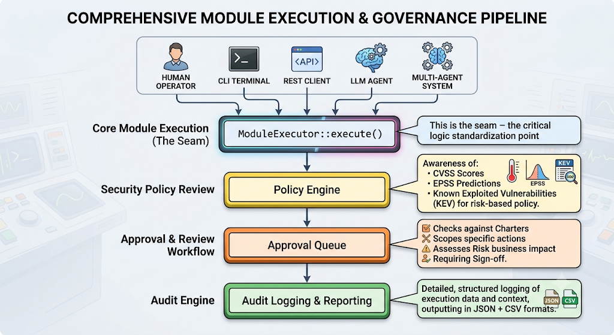

<div align="center">
  

  **ICEBOX: The runtime governance layer for autonomous security.**
  
  <br />

  [](https://github.com/Devaretanmay/icebox/actions)
  [](https://www.rust-lang.org/)
  [](LICENSE)
  [](python/icebox)
</div>

Welcome, let's get your ICEBOX environment set up.

ICEBOX is the runtime governance layer for autonomous security agents and offensive security tooling. It gives every human operator, REST client, and autonomous agent a single, auditable choke point — the **governance seam** — that must be passed before any action is taken against an authorized target.

### Operational Tiers

ICEBOX supports three distinct governance tiers to match your operational risk profile:

* **The Fridge** (Development): Basic guardrails and audit logging. Ideal for local testing and non-destructive agents.
* **The Freezer** (Staging): Enforced CVSS limits and sandbox containment. Designed for safe, controlled execution.
* **The Deep Freezer** (Production): Maximum security with strict explicit approvals, multi-factor sign-off, and absolute containment. Perfect for production environments.

<div align="center">
  
</div>

By centralizing policy enforcement, approval workflow, and audit capture in
one place, ICEBOX makes it possible to prove what an agent was permitted to
do, why, and whether the controls held. The bundled offensive modules are
reference implementations that exercise the seam — the framework itself is
built to govern arbitrary tools and agents, not just the ones shipped here.

## Table of contents

- [Features](#features)
- [Installation](#installation)
- [Quickstart](#quickstart)
- [SDK and language support](#sdk-and-language-support)
- [Architecture](#architecture)
- [Repository layout](#repository-layout)
- [Policy rule reference](#policy-rule-reference)
- [Self-governance](#self-governance)
- [Documentation](#documentation)
- [Security](#security)
- [Contributing](#contributing)
- [License](#license)

## Core Concepts

Before diving in, there are a few core concepts you need to understand about how ICEBOX operates.

### 1. The Governance Seam

ICEBOX enforces governance at exactly one point: `ModuleExecutor::execute()`. Every operator action, REST call, and agent step passes through it — that single choke point is what makes the whole system auditable. There is no way to bypass this seam.

### 2. Mandatory Sandboxing

By default, any action executed by an agent is safely contained inside an ephemeral Docker or Firecracker VM sandbox. This prevents security modules from modifying your host system or accessing sensitive local credentials. A module cannot break out of its container unless explicitly permitted by your configuration. Real payloads (e.g. port scans, SQL injections) are safely routed against disposable proxy targets.

### 3. Scope and Risk Management

ICEBOX will instantly block any module execution that falls outside of the allowed IP ranges/domains, or exceeds the maximum CVSS risk threshold you have defined. Hallucinating agents are stopped in their tracks.

## Features

| Area | What it does |
| --- | --- |
| **Policy engine** | Six rule types (`DenyCapability`, `AllowCapability`, `MaxRisk`, `RequireApproval`, `DenyIfCvssAbove`, `RequireApprovalIf`), CVSS 4.0 / EPSS / CISA KEV aware |
| **Approval workflow** | Charter acceptance, scope allowlist, max-risk ceiling, and explicit sign-off for destructive actions |
| **RBAC** | `viewer`, `operator`, `admin` roles with least-privilege enforcement |
| **Audit trail** | Every decision recorded with rationale; exportable as JSON or CSV |
| **Reasoning traces** | Per-phase explainability for autonomous agents |
| **Evidence intelligence** | Module output normalized, confidence-scored, and provenance-tagged |
| **Continuous validation** | Monotonic policy versioning, drift detection, diff reporting |
| **Multi-agent orchestration** | Concurrent agents sharing one governed audit trail |
| **Interfaces** | Interactive CLI (REPL) and a REST API with identical governance semantics |
| **SDKs** | Rust, and a Python `Workspace` orchestration class |

## Installation

The easiest way to get started with ICEBOX is through the unified Python SDK, which includes an interactive setup wizard that automatically installs the underlying Rust daemon (`icebox-daemon`) and checks your environment.

```sh
# 1. Install the unified CLI and SDK
pip install icebox-sdk

# 2. Run the interactive setup wizard
icebox
```

The wizard will check if Docker and the Rust toolchain are installed, and will seamlessly guide you through compiling and configuring the core engine.

### Alternative: Rust Crates

If you prefer to install the Rust daemon directly without the Python wizard:

```sh
cargo install icebox-gov
```

> **macOS note:** If Gatekeeper blocks the daemon on first run, clear the quarantine attribute:
> `xattr -dr com.apple.quarantine "$(command -v icebox-daemon)"`

### Docker (GHCR)
```sh
docker pull ghcr.io/devaretanmay/icebox:latest
docker run --rm -p 8443:8443 ghcr.io/devaretanmay/icebox
```

## Quickstart

### 1. Build from source

```bash
git clone https://github.com/Devaretanmay/icebox.git
cd icebox
cargo build --release
```

### 2. Run the CLI and REST API

```bash
cargo run           # interactive REPL + REST API on :8443
cargo run -- --api  # REST API only
```

```text
icebox> charter accept "pentest-2026-07"
icebox> scope add 10.0.0.0/8
icebox> list
icebox> use vuln_scanner
icebox> set project_dir /path/to/your/project
icebox> run --approve /path/to/your/project
```

### 3. Or drive it over REST

The API is served at `http://127.0.0.1:8443/api/v1`:

```bash
curl -X POST http://127.0.0.1:8443/api/v1/modules/vuln_scanner/run \
  -H 'Content-Type: application/json' \
  -d '{"target": "/path/to/project", "approved": true}'
```

### 4. Or govern an agent with the Python SDK

```python
from icebox import Governance

gov = Governance({
    "charter": {"accepted": True, "engagement": "demo", "rules_of_engagement": []},
    "scope": {"allow": ["10.0.0.0/8"]},
    "max_risk": "critical",
    "role": "admin",
})

verdict = gov.run({
    "name": "scan",
    "target": "10.0.0.5",
    "capabilities": ["network_scan"],
    "impact": "low",
    "destructive": False,
})
print(verdict)
```

### 5. Seamless Autonomous Agent Integration

ICEBOX acts as the ultimate "seatbelt" for Autonomous Agents by automatically generating OpenAI-compatible JSON tool schemas for all registered offensive modules:

```python
from icebox import IceboxClient

client = IceboxClient()
# Auto-generate OpenAI function schemas for Claude, GPT-4, etc.
tools = client.get_openai_tools()

# The LLM calls the tool, ICEBOX automatically preflights, 
# requests dashboard approval, and executes the real payload in the sandbox!
```

### 5. Layer in CVSS-aware policy

```bash
icebox> policy rule add deny-cvss 7.0
icebox> policy rule add require-approval-if --cvss 5.0 --epss 0.1 --kev
```

## SDK and language support

| SDK | Status | Usage |
| --- | --- | --- |
| Rust (native) | Available | `icebox-gov` crate |
| Python | Available | `icebox.Workspace` via REST API |
| TypeScript / Java / Go | Planned | Community contributions welcome |

## Architecture

ICEBOX enforces governance at exactly one point: `ModuleExecutor::execute()`.
Every operator action, REST call, and agent step passes through it — that
single choke point is what makes the whole system auditable.

- **Interfaces** — REPL CLI and an Axum REST API on `127.0.0.1:8443/api/v1`,
  both calling the same executor.
- **Module executor** — resolves a module, runs the policy preflight,
  executes, and records the outcome.
- **Policy engine** — six rule types, CVSS 4.0 / EPSS / KEV aware.
- **Approval engine** — a queue plus four safety gates (charter, scope,
  max-risk, approval).
- **Audit engine** — every decision normalized, scored, and
  provenance-tagged as JSON and CSV.

Modules register through the `#[module(...)]` proc macro (in
`icebox-macro`) and are collected at compile time via `linkme` into
`MODULE_REGISTRY`. That same registry feeds the CLI, the REST API, and the
C ABI, so every surface governs identically — there's no code path that
bypasses the seam.

## Repository layout

```
icebox/
├── Cargo.toml              # Single package: lib (SDK) + bin (CLI)
├── src/
│   ├── lib.rs              # Module declarations + MODULE_REGISTRY
│   ├── main.rs             # CLI / REST API binary
│   ├── capi.rs             # C ABI surface over the runtime
│   ├── core/               # The seam: executor, policy, audit, evidence
│   ├── modules/            # Example modules: vuln_scanner, recon, network
│   ├── ai/                 # Autonomous agent + multi-agent orchestrator
│   └── interfaces/         # REST API (Axum)
├── crates/
│   └── icebox-macro/       # #[module(...)] attribute macro
├── python/
│   └── icebox/             # Python SDK
├── dist/install.sh         # curl | sh installer
├── Dockerfile              # GHCR image
└── docs/                   # mdBook site
```

## Policy rule reference

| Rule | CLI command | Effect |
| --- | --- | --- |
| `DenyCapability` | `policy rule add deny network_scan` | Blocks a specific capability |
| `AllowCapability` | `policy rule add allow network_scan` | Pre-approves a capability |
| `MaxRisk` | `policy rule add maxrisk high` | Caps the risk ceiling |
| `RequireApproval` | *(via SDK builder)* | Gates on capability + target pattern |
| `DenyIfCvssAbove` | `policy rule add deny-cvss 7.0` | Blocks if CVSS exceeds threshold |
| `RequireApprovalIf` | `policy rule add require-approval-if --cvss 5.0 --epss 0.1 --kev` | Gates on CVSS / EPSS / KEV conditions |

## Self-governance

ICEBOX governs itself. The `governed_vuln_scan_blocks_high_cvss_exploit` test
runs the `vuln_scanner` module against ICEBOX's own source tree through the
governance seam, resolves real CVSS scores from OSV.dev, and verifies that
`DenyIfCvssAbove(7.0)` blocks hypothetical exploitation of high-CVSS
findings.

## Documentation

Full docs — SDK references, deployment guidance, and policy authoring — are
available locally in the [`docs/`](docs/) directory.

## Security

Please report vulnerabilities privately rather than through public issues.
See [SECURITY.md](SECURITY.md) for the disclosure process.

## Contributing

Contributions are welcome — see [CONTRIBUTING.md](CONTRIBUTING.md) for
guidelines.

## License

ICEBOX is released under the [MIT License](LICENSE).
